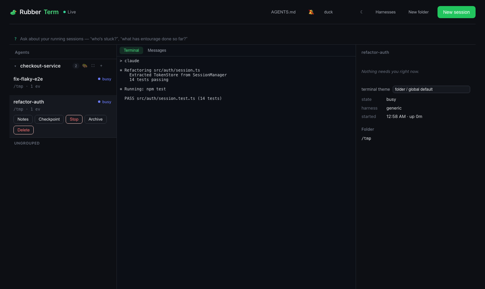

<div align="center">


# RubberTerm

**Run your CLI coding agents in real terminals in the browser — with the structured layer a raw terminal can't show.**

[](https://github.com/utsavanand/duckterm/actions/workflows/ci.yml)
[](https://github.com/utsavanand/duckterm/releases)
[](LICENSE)
[](pyproject.toml)

[Install](#install) · [Features](#features) · [Mac app](#mac-app) · [How it works](#how-it-works) · [Development](#development)



</div>

## What is this?

Claude Code, Codex, and Copilot live in terminal tabs. Running several at once
means alt-tabbing to find the one that's waiting on you, losing track of which
branch each is on, and having no way to ask "what has that session actually
done?"

RubberTerm launches each agent into a tmux-backed PTY it owns and renders it in
the browser with xterm.js — a real terminal you type into, not a transcript
viewer. Around the terminals it shows what a terminal can't:

- which session **needs you right now** (hook-driven state: busy / waiting / idle)
- **context pressure** per session — tokens used, model, and a "checkpoint or
  compact" warning before the window fills
- **approvals as buttons** — permission prompts resolve from the dashboard
- a **fleet chat bar** — ask questions about all running sessions at once
  ("who's stuck?", "what has refactor-auth done so far?")

Sessions survive server restarts (tmux), run in isolated git worktrees when you
want parallel attempts, and fork — including conversation forks for Claude Code.

## Install

```sh
pipx install duckterm        # or: pip install duckterm
duckterm serve               # dashboard on http://127.0.0.1:4300
duckterm install-hooks       # wire agent hooks (approvals, state, sub-agents)
```

Requirements: macOS or Linux, Python ≥ 3.11, tmux, and the agent CLIs you want
to run (`claude`, `codex`, …) on your PATH. Agents run under **your own
subscription** — RubberTerm never calls a model API itself.

## Features

**Terminals, first-class**
- Every session is a live xterm.js terminal: type, paste, Ctrl-C, 5000 lines of
  scrollback. Six color themes, assignable globally, per folder, or per session.
- Launch with any of your installed oh-my-zsh prompt themes per session,
  without touching your `.zshrc`.

**Fleet control**
- Folders nest and drag; each folder opens as a **grid** — iTerm-style splits
  (drag a pane onto another's edge to restack), resize bars, a dock for
  collapsed sessions, a folder switcher.
- Stop is a pause (Resume relaunches — continuing the conversation for Claude
  Code); Archive is final; Delete requires a second click.
- Fleet chat: one question, answered from a digest of every running session's
  state, goal, and screen.

**The structured layer**
- **Messages view** — the conversation rendered as HTML; select any span of a
  reply, attach a note, and it's sent back to the agent as a follow-up turn.
- **Sub-agent tree** — Task-tool sub-agents nested under their parent, live.
- **Worktrees & forks** — launch into an isolated worktree per attempt; fork a
  session's git state or (Claude Code) its conversation; compare branches.
- **AGENTS.md that learns** — "Suggest from corrections" distills the feedback
  you've given agents (annotations, follow-up prompts) into proposed rules you
  review before saving.
- **Installable harnesses** — register a suite of skills/hooks/sub-agents
  (e.g. uv-suite) and install it into any project from the dashboard, with
  per-suite option pickers and compatibility declarations.
  Contract: [docs/harnesses.md](docs/harnesses.md).

## Mac app

A WKWebView shell around the same dashboard, with native notifications:
download `RubberTerm-*-mac.zip` from
[Releases](https://github.com/utsavanand/duckterm/releases), unzip, drag to
/Applications. It attaches to a running server or starts one. The app is
ad-hoc signed — first launch needs right-click → Open.

## How it works

One Python asyncio server (no framework), SQLite for history, tmux for session
persistence. Agents report through their own hook systems (`duckterm
install-hooks`) — session start, tool use, permission requests — which drive
the state badges, approvals, and the sub-agent tree. The terminal is a binary
WebSocket carrying raw PTY bytes to xterm.js; context-pressure numbers are read
from the agent's transcript on disk. Everything runs on 127.0.0.1: GETs are
loopback-gated, state-changing POSTs are token-gated.

RubberTerm is the terminal-forward sibling of
[Rubberduck](https://github.com/utsavanand/rubber-duck), which *watches* agents
you run in your own terminal tabs instead of owning the PTY. Install either or
both.

## Development

```sh
pip install -e ".[dev]"
(cd web && npm install)
scripts/check.sh        # the whole gate: lint, types, pytest, vitest, Playwright e2e
```

Design docs: [terminal-forward-design.md](docs/terminal-forward-design.md),
[structured-render-design.md](docs/structured-render-design.md).

## License

[FSL-1.1-MIT](LICENSE) — the Functional Source License. You can read, run,
modify, and redistribute RubberTerm for any purpose except offering a
competing product; each release automatically becomes plain MIT two years
after it ships.
