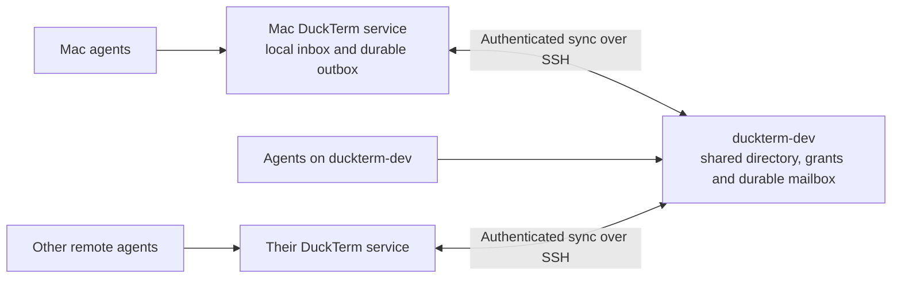

# Cross-computer session collaboration

Owner-approved design · 2026-10-05 · remote-session-dev

**Owner decisions:** sessions in the same canonical sidebar folder collaborate by default, whether local or remote; no separate per-folder or per-session sharing switch. Use `duckterm-dev` as the always-on coordinator. Remote agents must continue collaborating with one another while the Mac sleeps. Messages for Mac sessions wait until the Mac can receive them. Owner approved the revised design with “lgtm”. Architectural review and implementation remain outstanding; no deployment or implementation is claimed.

## Experience and acceptance target

An agent on a remote machine runs its existing `duckterm session discover`, sees `main-local · This Mac`, and sends it a question. The local agent receives that question in its existing Inbox and replies normally. Both cards remain in the same DuckTerm window. Machines keep their own processes, terminals, working directories and native conversations.

Example: remote agent asks “Please build commit abc123 on macOS and report the test result.” If the Mac is asleep, the message reads **Waiting for This Mac**. When the Mac reconnects, the same request reaches `main-local` once. The local agent decides how to handle it under its existing authority and returns the result. Sending a message does not grant build, installation, release or command-execution authority. It does not automatically transfer source files; the build request should identify an accessible repository and commit.

The immediate feature is discovery, direct questions, accept/decline/reply/cancel, and honest delivery status across computers. Cross-computer task assignment, folder broadcasts, automatic execution and artifact bytes are separate capabilities, not implied by a working inbox.

## Why it does not work today

`SessionAPI` discovers members and stores questions in the serving instance's SQLite database. `session_client.py` authenticates to that local service with the current session's capability. The Mac combines remote session cards through `hostTransport.ts` and the native transport, but remote sidebar groups are browser presentation metadata. Moving a remote card beside a local card does not create a shared authorization boundary or directory.

`RemoteConnection` currently belongs to the desktop app; quitting closes its tunnels and the app-owned local server. Cross-computer delivery must therefore belong to server services, not a selected tab, browser localStorage, terminal attachment or desktop-only tunnel.

## Architecture



Run the coordinator as a module of the existing `duckterm-dev` DuckTerm service. Do not add a public HTTP listener, separate paid queue or external SaaS. Other computers initiate outbound SSH tunnels using saved, verified host configurations; their local DuckTerm services exchange bounded batches with the coordinator over loopback. Replies use the same channel, so the coordinator never needs inbound SSH access to the Mac. Every additional remote needs its own authorized outbound connection to the coordinator; a connection from the Mac to that remote is not sufficient. No laptop SSH private keys are copied to remotes.

Each service still owns its sessions and native runtime identity. It exports workspace session cards and collaboration operations according to canonical sidebar membership, with same-folder collaboration enabled by default. The coordinator owns shared workspace policy, discovery snapshots and cross-computer question transitions. A machine-wide pairing capability is separate from session credentials and from dashboard owner authentication. Agents never receive the pairing credential or remote owner tokens through discovery, messages or launch instructions.

The coordinator is a single point of availability in version 1. If it is down, same-machine collaboration continues; cross-computer messages remain in durable sender outboxes and appear **Waiting for coordinator**. Do not promote another coordinator automatically or create competing authorities. Failover requires a later explicit recovery design.

## Connect computers once; folder membership enables collaboration

The normal rule is **same sidebar folder = same collaboration group**, regardless of computer. There is no “Share agents across computers” toggle and no separate per-session enrollment step. Adding a local or remote session to Duckterm immediately makes it discoverable and addressable to peers in Duckterm, subject to the same folder-tree scope semantics as local sessions. Moving it out updates that access. Ungrouped sessions remain private.

1. In **Settings → Collaboration**, choose the existing `duckterm-dev` connection as coordinator. Show its verified computer identity and protocol support.
2. Connect This Mac and each participating remote through the owner-authenticated computer setup flow. This is the one-time trust step, integrated with adding a remote computer rather than repeated for every folder. Exchange a short-lived, single-use enrollment challenge over the verified connection; issue a revocable capability bound to workspace and stable computer ID. A session token cannot connect computers or change another session's membership.
3. The workspace sidebar becomes the canonical folder tree across connected computers. Folder creation, rename and session moves are normal owner operations, persisted by the coordinator and synchronized to the hosting service. Same-folder permissions are derived automatically from that membership; agents do not create grants themselves.
4. Existing running sessions join automatically according to where the owner has placed their cards. New sessions inherit the selected folder. Generated instructions explain cross-computer references and offline delivery; owners need not manually reinitialize agents.

For existing installations, import the owner's current unified sidebar arrangement into stable workspace folder IDs. This fixes the old presentation-only grouping: a remote card already shown in Duckterm becomes an actual Duckterm member. Migration must preserve the visible arrangement, running processes and drafts. If different saved views disagree, use the owner's active arrangement as the proposed canonical tree and surface only the conflicting moves for resolution; do not invent a per-folder sharing approval flow. Later stale browser state cannot overwrite server membership.

Renames preserve stable folder identity. Identical text labels in different workspaces or different parent paths remain different folders; computers do not gain access by independently advertising a matching name. Changes made while disconnected appear **Pending sync**. Local exclusion takes effect immediately; newly granted cross-computer visibility waits for the coordinator to commit the move. Do not promise global completion before that acknowledgment.

Wireframe for the design review (not implemented UI):

```text
Collaboration
Coordinator        duckterm-dev              Connected
Workspace          My workspace
Computers          This Mac                  Connected
                   duckterm-dev              Connected
                   build-linux               Not connected

Sessions in the same sidebar folder can discover and message
one another across these computers.

Duckterm
  main-local        This Mac
  main-remote       duckterm-dev

Messages for an offline computer wait until it reconnects.
[Manage computers]
```

## Identity and scope

Use stable identifiers: `workspace_id`, `computer_id`, `folder_id`, local `session_key`, and a pairing incarnation. A global session reference combines computer ID and local session key; the backend must not adopt the UI's browser-local connection ID as authority. Display `main-local · This Mac`, but route with the global reference returned by discovery. Duplicate display names cause an explicit ambiguity error if a CLI alias is used; never choose the first match.

Keep existing unqualified session IDs working for same-machine calls. Add `session_ref` and computer/workspace information to discovered cards. New CLI callers can pass an opaque global reference to `ask`; older CLI/server combinations that lack federation return a supported-version explanation, not an empty list that resembles successful discovery.

A service can publish only session keys on its own paired computer, using coordinator-confirmed canonical folder memberships established by owner sidebar actions. It must not assert another computer's identity, owner-message priority, arbitrary workspace membership or another session's reply. The local service authenticates its calling agent and derives the sender itself; the coordinator authenticates the service and validates the claim. Computer connection does not expose unrelated workspaces or private ungrouped sessions.

The coordinator derives collaboration scope from current workspace and canonical folder membership. Origin and destination services enforce the synchronized policy and session lifecycle, with no second hidden per-folder opt-in. Preserve self-folder/parent/grandparent discovery and permitted shared-root semantics using stable folder ancestry, consistently for local and remote sessions. Same-folder discovery is automatic; an ancestor query cannot exceed the existing shared-root boundary.

Version 1 assumes the existing trusted OS-user boundary. A token file owned by the same OS user is not isolation against a malicious process with that user's filesystem privileges. Strong isolation between mutually untrusted agents is separate work; do not claim this transport provides it.

## Discovery and presence

`duckterm session discover` combines permitted same-machine cards and eligible coordinator cards, deduplicated by global reference. Each result includes computer name, session name, purpose, activity, source timestamp, capabilities and availability.

Keep these distinct:

| Field | Meaning |
| --- | --- |
| Computer connection | Service is connected, disconnected or unknown |
| Session state | Last locally observed busy/waiting/stopped state |
| Delivery ability | Can receive now, will queue, or is unavailable |
| Freshness | Time at which the owning service last confirmed the card |

A connected service does not prove an agent process is alive; a stale busy card does not prove a sleeping Mac is executing. First-time offline computers cannot contribute an invented directory. Return cached previously authorized cards only with stale status and explicit delivery restrictions. An offline target stays discoverable if its last authorized membership and identity remain valid; stopped/deleted targets are shown as unavailable rather than accepting new work silently.

If the coordinator cannot be contacted, return local results plus `cross_computer_status: unavailable` and an explanation. An empty successful array alone is insufficient. Pagination uses opaque snapshot/cursor tokens and stable global ordering, never local SQLite row IDs from different hosts.

## Durable question protocol

Agents keep the same verbs: `discover`, `ask`, `inbox`, `accept`, `reply`, `decline`, `cancel`, `get`. Their CLI talks only to their own service. Add federation routing below that API; do not teach agents to use dashboard owner tokens or directly invoke another computer's `/input` route.

Transport state is separate from the existing question state:

| Transport | Exact claim |
| --- | --- |
| Saved on this computer | Sender outbox committed, coordinator has not acknowledged |
| Waiting for target computer | Coordinator committed the question, destination has not acknowledged |
| Delivered to inbox | Destination durably committed its inbox entry |
| Read | Recipient fetched the message through its authenticated inbox |
| Reply waiting to sync | Recipient's reply is durable locally but not committed at coordinator |
| Blocked / expired | Terminal routing or permission failure with a reason |

Existing queued/accepted/answered/declined/cancelled question states continue to describe handling. “Accepted” means the agent accepted the request, not that a network packet arrived. A delivery receipt does not mean the agent acted on it.

On send, the origin authenticates the session, validates the target reference against a previously authorized directory record, and commits an outbox row before returning. The coordinator transaction validates current scope and commits the immutable question plus a delivery event. The destination transaction persists the inbox row and cursor before acknowledging. It rechecks local membership and identity; a superseded or deleted target is rejected explicitly. No message can launch a replacement session automatically.

Use a stable global question ID and a sender-scoped idempotency key plus payload hash. Retries reuse those values; changed content with the same key returns conflict. Delivery is at least once; deduplication produces one visible question and one notification event per question revision. This does not promise exactly-once execution of the work described by the message.

Replies and transitions carry the canonical question ID, expected revision and actor identity. The coordinator serializes concurrent transitions, retaining the current local API's terminal-state rules. An offline reply is “reply waiting to sync,” not a confirmed remote answer. Cancellation before initial send removes the unsent item locally; cancellation after coordinator acceptance is a versioned coordinator operation. A reply/cancel race resolves once at the coordinator and propagates that result. Never overwrite a terminal answer on reconnect or move the request to a new similarly named agent.

If a network response is lost after commit, retry/query using the same operation ID. Crash tests cover every transaction/ack boundary. Delivery acknowledgments are persisted before a sender may discard its outbox payload. Cursor advancement alone never proves an application transition succeeded.

## Offline behavior and lifecycle

| Situation | Result |
| --- | --- |
| Mac sleeps or disconnects | Remote-to-remote messaging continues through duckterm-dev. Mac-bound questions wait; no Mac builds run. |
| Mac wakes | Authenticate, reconcile revocations/membership first, publish current presence, then deliver still-authorized queued operations. |
| Mac window closes under today's lifecycle | Mac server stops; treat it as offline. Do not advertise background delivery. |
| Background collaboration enabled | A single user LaunchAgent owns the local server/sync worker; closing the UI does not stop it. Sleep still stops useful local execution. |
| Coordinator restarts | Durable questions, grants and operations replay safely; peers reauthenticate and reconcile cursors. |
| Coordinator disk full | Reject acceptance explicitly. Keep sender outbox; never acknowledge persistence that failed. |
| Computer/session removed | Mark undelivered questions blocked; no delivery to reused names or restored stale identities. |

For version 1, include an explicit **Keep collaboration running when the window is closed** option backed by a user LaunchAgent. It is selected only through owner setup, not silently enabled by pairing. Refactor Mac server ownership so the app attaches to the managed server and never creates a second server, competing tunnel or duplicate relay worker. Migrate only with a reversible handoff that preserves running agent processes and pending drafts; if this cannot be demonstrated, ship with an honest “Mac app must remain open” requirement and keep the background option unavailable. This lifecycle work is separately testable and must not delay correct offline queuing.

No extra hosted service is proposed; the coordinator uses the existing VM. Incremental storage/network/CPU and provider work still consume resources. No dollar-cost estimate is asserted here. Mac-offline queues do not trigger provider calls.

## Revocation, retained data and failure limits

Owners can move a session to another folder or to Ungrouped, remove a session, or disconnect a computer. Folder membership changes are the permission controls; there is no separate folder sharing toggle. Coordinator changes take effect transactionally there; local removals deny local exports/imports immediately and sync revocation before other work. A revocation made on an offline computer cannot instantly reach the coordinator—show **Pending sync** rather than claiming global completion. Reconnect applies revocations before message delivery.

Check grants when accepting an operation, when importing to a target inbox and when exposing cross-computer content to an agent. Require current coordinator validation for new cross-computer content reads; during coordinator outage show a temporary unavailable state rather than serving never-read content under potentially revoked grants. Data already delivered/read cannot be made unknown again; revocation blocks subsequent access and delivery, not a promise to erase copies an agent already consumed. Previously recorded owner-visible audit history remains local and clearly marked revoked where applicable.

Pairing secrets use least-privilege service capabilities, rotation/revocation, private local storage and no credential-bearing logs. SSH host verification stays mandatory. Tokens bind workspace, computer and pairing incarnation; restoring or cloning a computer disk must not silently create two active writers under one identity. Detect duplicate incarnation/lease claims and require owner recovery. The coordinator stores intended message content; disclose that during computer/workspace setup. Do not export environment variables, source files, transcripts, credentials or filesystem paths merely for discovery.

Initial bounded defaults: 30-second long poll; 15-second presence heartbeat; disconnected after 60 seconds without confirmation; 100 operations or 1 MiB per exchange; 16 KiB question and 256 KiB answer limits preserved; 10 cross-computer sends/minute/session and 20 pending cross-computer questions per session enforced at the coordinator plus local admission (existing same-machine limits remain separate); 10,000 queued operations or 64 MiB per paired computer; retry with jitter from 1 to 60 seconds. Full queues return an actionable error, never drop old pending work. Pending requests persist until answered/cancelled or their explicit existing deadline expires. Tombstones/idempotency metadata persist with canonical question history; an expired sync cursor requires a policy-first snapshot rather than replaying forgotten IDs. Retention/compaction must preserve deduplication and unresolved operations.

## Storage and code boundaries

This requires a versioned schema migration; it is not a UI-only patch. Proposed conceptual tables: local computer identity/pairing; coordinator workspaces/canonical folders/memberships; advertised peers and revisions; canonical cross-computer questions/transitions; local outbox, inbox receipts and sync cursors. Use bounded typed records and migrate through the existing schema version mechanism. Do not insert foreign agents as locally launched `sessions` rows or copy entire databases. Existing local-only SessionAPI data and behavior remain valid when federation is disabled.

A new collaboration transport/service layer owns authenticated exchange, schema validation, reconciliation and outbox transactions. `SessionAPI` authenticates the current session and delegates global-reference operations; local questions continue through the existing path. `session_client.py` supports references/status fields and returns useful errors to old clients. The Mac connection layer supplies owner-approved host setup; a server-owned sync worker handles delivery. UI cards/folders consume stable workspace memberships rather than localStorage as authority.

Tentative coordinator operations: negotiate protocol/capabilities; owner enrollment/revoke; authenticated peer advertise/sync; directory query; submit/transition/get question; acknowledge destination receipt. Peers may act only for their own computer's sessions. Keep enrollment/policy endpoints separate from relay endpoints. Choose exact route names after architectural review; do not reuse owner `/sessions/.../input` endpoints as a messaging transport.

Additive negotiation must explicitly advertise discovery, direct messaging, and artifact transfer separately. Old remote versions report upgrade required for missing cross-computer features while continuing existing local collaboration. Rollback disables sync safely and preserves queued data; never run an older binary on a newer database against existing schema guards.

## Build artifacts and source transfer

Version 1 answers can include commit SHAs, test summaries and owner-approved links. A local artifact path is not a usable remote download. Cross-computer artifact listing/downloading must remain explicitly unsupported until implemented.

Next increment: explicitly attach a registered immutable artifact to a question, enforce the same grants at source/coordinator/destination, bound size to the existing 5 MiB limit, verify hashes, preserve no-overwrite/private-file download behavior and show origin. Never transfer an entire project or credential directory to make an artifact link work. Large app builds need a separately selected destination/upload path and its own authorization. Task handoff/broadcasts then require explicit global identity and shared-scope semantics; they must not silently call their local-only implementations with a foreign key.

## Delivery plan and required proof

1. Agree this contract and owner-facing sharing/status preview. Confirm service ownership and schema details with architect/main-dev; align UI with ui-dev and release flow with release-dev. No production pairing during design.
2. Implement protocol/identities/grants and independent two/three-server fixture tests. Keep feature disabled until pairing completes.
3. Add directory and direct question/reply flows, durable queues, revocation and crash recovery; update generated instructions and CLI errors.
4. Integrate canonical sidebar membership and host badges/status into the existing single window. Add background Mac lifecycle only after preserving live sessions is demonstrated.
5. Isolated real-service QA with synthetic agents; then a controlled native remote-to-Mac build request with owner-approved repository/commit and test records. Release through release-dev with compatibility and rollback evidence.
6. Add explicit small artifact attachments; broader workflow/task features follow separate reviewed contracts.

Acceptance must prove: local and remote sessions in the same folder discover/message each other by default without an extra toggle or enrollment prompt; existing visual grouping migrates to the same real scope; moves, new sessions, nested folders, renames and duplicate folder labels preserve the local collaboration semantics; remote discovers main-local under the right scope; replies route to the exact originating computer/session; two remotes exchange while Mac is stopped; Mac-bound questions queue and arrive once after wake; local collaboration survives coordinator outage; duplicate IDs/names across hosts never collide; disconnect after every commit/ack loses no acknowledged operation; stopped/archived/moved/revoked targets do not receive new requests; cancel/reply races settle consistently; no foreign sender/owner/priority forgery; stale grants/cursors and cloned/restored identities cannot replay access; queue/disk limits fail honestly; local/remote processes and unsent drafts remain unchanged by pairing, reconnect or UI navigation; no second window opens; all test:true fixtures and owned processes are cleaned up.

Design completion is not feature completion. Only demonstrated installed behavior may be marked shipped on the roadmap.


## Implementation status

Status: implementation in progress; not approved for merge, release, installation or production pairing.

The owner approved duckterm-dev as the always-on coordinator and automatic collaboration for sessions in the same canonical sidebar folder. This branch adds a zero-dependency SQLite coordinator, computer capabilities, stable references, a durable local outbox, scoped discovery, versioned request transitions, offline replies, delivery/read receipts, and server-owned SSH transport. The existing session commands and inbox carry cross-computer messages. Local discovery remains available during coordinator outage.

The Mac setup broker keeps pairing credentials out of JavaScript. Settings → Collaboration previews the participating sessions and folder arrangement before connecting. The UI states that the Mac app must stay open, that messages queue for offline computers, and that Ungrouped sessions remain private. The generated setup screenshot is /tmp/duckterm-collaboration-preview.png.

Verified boundaries: coordinator persistence and idempotency; remote-to-remote exchange while the simulated Mac is offline; queued Mac delivery without duplicate questions; reply/cancel conflict; duplicate active writer refusal; revoked grants and narrower local roots; one-use pairing tickets; real loopback HTTP between two independent HistoryStore/server instances; offline reply synchronization through the existing session API; stable root identity after a coordinator rename; native compilation; and browser sharing-preview flow. Fixtures use synthetic sessions and no provider inference.

Remaining implementation/acceptance work before release:

- Wire every ordinary folder create/rename/reparent/delete entry point to canonical policy, including nested and concurrent changes. The coordinator rename protocol exists, but the sidebar entry points are not yet fully routed through it. Resolve conflicting saved sidebar arrangements explicitly.
- Complete computer status/disconnect/recovery UX and retry after interruption at every setup phase. Establish that pairing and restart preserve real running processes and drafts.
- Verify owner folder-interaction history, reminder delivery and pagination with mixed local/remote traffic and large histories.
- Prove actual server-owned SSH pairing and Mac sleep/wake behavior with isolated Linux services; current transport acceptance uses real local HTTP with synthetic computers.
- Complete exact-head review with release-dev, fresh committed-tree verification and the release gate. Do not infer installed acceptance from a simulated native bridge.

No production database, session process, provider transcript, SSH key or computer pairing was changed by this implementation work.
